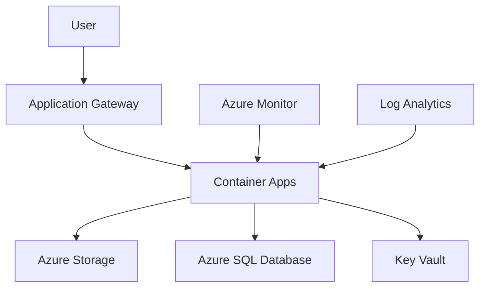

# 🏗️ Terraform Azure Best Practice Implementation Standard

This document establishes comprehensive best practices for implementing Terraform infrastructure targeting Microsoft Azure, ensuring consistency, security, maintainability, and operational excellence.

## 📋 Table of Contents

- [Core Principles](#core-principles)
- [Project Structure](#project-structure)
- [Provider Configuration](#provider-configuration)
- [Resource Naming](#resource-naming)
- [Variable Management](#variable-management)
- [State Management](#state-management)
- [Security Best Practices](#security-best-practices)
- [Module Design](#module-design)
- [Environment Management](#environment-management)
- [Azure-Specific Guidelines](#azure-specific-guidelines)
- [Code Quality](#code-quality)
- [Documentation Requirements](#documentation-requirements)
- [CI/CD Integration](#cicd-integration)
- [Monitoring and Observability](#monitoring-and-observability)
- [Cost Management](#cost-management)
- [Disaster Recovery](#disaster-recovery)

## 🎯 Core Principles

### 1. Infrastructure as Code (IaC)
- **Declarative Configuration**: Define desired state, not procedural steps
- **Version Control**: All Terraform code must be version controlled
- **Immutable Infrastructure**: Replace rather than modify resources
- **Idempotency**: Configurations should produce consistent results

### 2. Security by Design
- **Least Privilege**: Grant minimum required permissions
- **Defense in Depth**: Multiple security layers
- **Zero Trust**: Never trust, always verify
- **Compliance First**: Meet regulatory requirements by default

### 3. Operational Excellence
- **Automation**: Minimize manual interventions
- **Observability**: Comprehensive monitoring and logging
- **Reliability**: Design for failure scenarios
- **Maintainability**: Clear, readable, and well-documented code

## 📁 Project Structure

### Standard Directory Layout
```
terraform/
├── environments/
│   ├── dev/
│   │   ├── main.tf
│   │   ├── variables.tf
│   │   ├── terraform.tfvars
│   │   └── outputs.tf
│   ├── staging/
│   └── production/
├── modules/
│   ├── container-app/
│   │   ├── main.tf
│   │   ├── variables.tf
│   │   ├── outputs.tf
│   │   └── README.md
│   ├── storage/
│   └── networking/
├── shared/
│   ├── locals.tf
│   ├── data.tf
│   └── versions.tf
├── scripts/
│   ├── deploy.sh
│   ├── validate.sh
│   └── cleanup.sh
└── docs/
    ├── architecture.md
    └── runbooks.md
```

### File Organization Rules

#### **Required Files**
- [`main.tf`](terraform/main.tf) - Primary resource definitions
- [`variables.tf`](terraform/variables.tf) - Variable declarations
- [`outputs.tf`](terraform/outputs.tf) - Output value definitions
- [`versions.tf`](terraform/versions.tf) - Provider version constraints
- [`README.md`](terraform/README.md) - Module/environment documentation

#### **Optional Files**
- [`locals.tf`](terraform/locals.tf) - Local value calculations
- [`data.tf`](terraform/data.tf) - Data source definitions
- [`terraform.tfvars`](terraform/terraform.tfvars) - Variable value assignments

## 🔧 Provider Configuration

### Azure Provider Setup
```hcl
# versions.tf
terraform {
  required_version = ">= 1.5.0"
  
  required_providers {
    azurerm = {
      source  = "hashicorp/azurerm"
      version = "~> 3.80"
    }
    random = {
      source  = "hashicorp/random"
      version = "~> 3.4"
    }
  }
  
  # Remote state configuration
  backend "azurerm" {
    resource_group_name  = "terraform-state-rg"
    storage_account_name = "terraformstatestore"
    container_name      = "tfstate"
    key                = "environments/production/terraform.tfstate"
  }
}

# Configure Azure Provider
provider "azurerm" {
  features {
    resource_group {
      prevent_deletion_if_contains_resources = true
    }
    
    storage {
      delete_retention_policy {
        days = 7
      }
    }
    
    key_vault {
      purge_soft_delete_on_destroy    = false
      recover_soft_deleted_key_vaults = true
    }
  }
  
  # Use environment variables or managed identity
  # Avoid hardcoding credentials
}
```

### Provider Feature Configuration
```hcl
provider "azurerm" {
  features {
    # Resource Group features
    resource_group {
      prevent_deletion_if_contains_resources = true
    }
    
    # Storage features
    storage {
      delete_retention_policy {
        days = 30
      }
      purge_protection_enabled = true
    }
    
    # Key Vault features
    key_vault {
      purge_soft_delete_on_destroy    = false
      recover_soft_deleted_key_vaults = true
      purge_soft_deleted_secrets_on_destroy = false
    }
    
    # Virtual Machine features
    virtual_machine {
      delete_os_disk_on_deletion     = true
      graceful_shutdown             = false
      skip_shutdown_and_force_delete = false
    }
  }
}
```

## 🏷️ Resource Naming

### Naming Convention Standard
```hcl
# locals.tf
locals {
  # Standard naming convention
  naming_convention = {
    prefix      = var.organization_prefix    # e.g., "jkl"
    environment = var.environment           # e.g., "prod", "dev", "staging"
    workload    = var.workload_name        # e.g., "webapp", "api", "db"
    region      = var.region_short         # e.g., "we", "eu", "us"
  }
  
  # Common name components
  base_name = "${local.naming_convention.prefix}-${local.naming_convention.workload}-${local.naming_convention.environment}"
  
  # Resource-specific naming
  resource_group_name = "${local.base_name}-rg"
  storage_account_name = lower(replace("${local.base_name}st${random_string.storage_suffix.result}", "-", ""))
  container_registry_name = lower(replace("${local.base_name}acr${random_string.acr_suffix.result}", "-", ""))
  key_vault_name = "${local.base_name}-kv-${random_string.kv_suffix.result}"
}

# Random suffixes for globally unique names
resource "random_string" "storage_suffix" {
  length  = 4
  upper   = false
  special = false
}

resource "random_string" "acr_suffix" {
  length  = 4
  upper   = false
  special = false
}

resource "random_string" "kv_suffix" {
  length  = 4
  upper   = false
  special = false
}
```

### Azure Resource Naming Guidelines

#### **Resource Group**
- Format: `{prefix}-{workload}-{environment}-rg`
- Example: `jkl-webapp-prod-rg`

#### **Storage Account**
- Format: `{prefix}{workload}{env}st{suffix}`
- Example: `jklwebappprodst1a2b`
- Constraints: 3-24 characters, lowercase alphanumeric only

#### **Container Registry**
- Format: `{prefix}{workload}{env}acr{suffix}`
- Example: `jklwebappprodacr1a2b`
- Constraints: 5-50 characters, alphanumeric only

#### **Key Vault**
- Format: `{prefix}-{workload}-{env}-kv-{suffix}`
- Example: `jkl-webapp-prod-kv-1a2b`
- Constraints: 3-24 characters

## 📝 Variable Management

### Variable Declaration Standards
```hcl
# variables.tf

# Required variables (no default values)
variable "environment" {
  description = "Environment name (dev, staging, prod)"
  type        = string
  
  validation {
    condition = contains(["dev", "staging", "prod"], var.environment)
    error_message = "Environment must be one of: dev, staging, prod."
  }
}

variable "location" {
  description = "Azure region for resource deployment"
  type        = string
  
  validation {
    condition = can(regex("^[a-z]+\\s[a-z]+$", var.location))
    error_message = "Location must be a valid Azure region name."
  }
}

# Optional variables (with defaults)
variable "container_app_settings" {
  description = "Container App configuration settings"
  type = object({
    cpu_cores        = number
    memory_gb        = number
    min_replicas     = number
    max_replicas     = number
    target_port      = number
  })
  
  default = {
    cpu_cores        = 0.5
    memory_gb        = 1
    min_replicas     = 1
    max_replicas     = 10
    target_port      = 8000
  }
  
  validation {
    condition = var.container_app_settings.min_replicas <= var.container_app_settings.max_replicas
    error_message = "Min replicas must be less than or equal to max replicas."
  }
}

# Complex variable with validation
variable "network_security_rules" {
  description = "Network security group rules configuration"
  type = list(object({
    name                       = string
    priority                   = number
    direction                  = string
    access                     = string
    protocol                   = string
    source_port_range          = string
    destination_port_range     = string
    source_address_prefix      = string
    destination_address_prefix = string
  }))
  
  default = []
  
  validation {
    condition = alltrue([
      for rule in var.network_security_rules :
      rule.priority >= 100 && rule.priority <= 4096
    ])
    error_message = "Security rule priorities must be between 100 and 4096."
  }
}

# Sensitive variables
variable "admin_password" {
  description = "Administrator password for resources"
  type        = string
  sensitive   = true
  
  validation {
    condition = length(var.admin_password) >= 12
    error_message = "Admin password must be at least 12 characters long."
  }
}
```

### Environment-Specific Configuration
```hcl
# environments/production/terraform.tfvars
environment = "prod"
location    = "West Europe"

container_app_settings = {
  cpu_cores        = 2.0
  memory_gb        = 4
  min_replicas     = 3
  max_replicas     = 20
  target_port      = 8000
}

# Security settings
enable_network_restrictions = true
allowed_ip_ranges = [
  "10.0.0.0/8",
  "172.16.0.0/12"
]

# Backup and retention
backup_retention_days = 30
log_retention_days   = 90

# Tags
common_tags = {
  Environment    = "Production"
  Project        = "FastAPI Web Application"
  Owner          = "Platform Team"
  CostCenter     = "Engineering"
  Backup         = "Required"
  Monitoring     = "Critical"
}
```

## 🗃️ State Management

### Remote State Configuration
```hcl
# Configure Azure Storage backend
terraform {
  backend "azurerm" {
    resource_group_name  = "terraform-backend-rg"
    storage_account_name = "terraformbackendstore"
    container_name      = "tfstate"
    key                = "environments/production/terraform.tfstate"
    
    # State locking
    use_azuread_auth = true
  }
}
```

### State Management Best Practices

#### **State File Security**
```bash
# Create state storage with proper configuration
az storage account create \
  --name terraformbackendstore \
  --resource-group terraform-backend-rg \
  --location "West Europe" \
  --sku Standard_LRS \
  --encryption-services blob \
  --https-only true \
  --min-tls-version TLS1_2

# Enable versioning
az storage account blob-service-properties update \
  --account-name terraformbackendstore \
  --enable-versioning true

# Configure lifecycle management
az storage account management-policy create \
  --account-name terraformbackendstore \
  --policy state-lifecycle-policy.json
```

#### **State Locking**
```hcl
# State locking configuration
terraform {
  backend "azurerm" {
    # ... other configuration
    use_azuread_auth = true
    
    # Optional: Custom client configuration
    client_id       = var.terraform_client_id
    client_secret   = var.terraform_client_secret
    tenant_id       = var.terraform_tenant_id
  }
}
```

## 🔒 Security Best Practices

### Identity and Access Management
```hcl
# Managed Identity configuration
resource "azurerm_user_assigned_identity" "main" {
  name                = "${local.base_name}-identity"
  location            = azurerm_resource_group.main.location
  resource_group_name = azurerm_resource_group.main.name
  
  tags = local.common_tags
}

# RBAC assignments with least privilege
resource "azurerm_role_assignment" "container_registry_pull" {
  scope                = azurerm_container_registry.main.id
  role_definition_name = "AcrPull"
  principal_id         = azurerm_user_assigned_identity.main.principal_id
}

resource "azurerm_role_assignment" "storage_blob_contributor" {
  scope                = azurerm_storage_account.main.id
  role_definition_name = "Storage Blob Data Contributor"
  principal_id         = azurerm_user_assigned_identity.main.principal_id
}
```

### Network Security
```hcl
# Network Security Group with default deny
resource "azurerm_network_security_group" "main" {
  name                = "${local.base_name}-nsg"
  location            = azurerm_resource_group.main.location
  resource_group_name = azurerm_resource_group.main.name
  
  # Default deny all inbound
  security_rule {
    name                       = "DenyAllInbound"
    priority                   = 4096
    direction                  = "Inbound"
    access                     = "Deny"
    protocol                   = "*"
    source_port_range          = "*"
    destination_port_range     = "*"
    source_address_prefix      = "*"
    destination_address_prefix = "*"
  }
  
  tags = local.common_tags
}

# Storage account with network restrictions
resource "azurerm_storage_account" "main" {
  name                = local.storage_account_name
  resource_group_name = azurerm_resource_group.main.name
  location            = azurerm_resource_group.main.location
  
  account_tier             = "Standard"
  account_replication_type = "GRS"
  
  # Security settings
  shared_access_key_enabled       = false
  infrastructure_encryption_enabled = true
  min_tls_version                 = "TLS1_2"
  https_traffic_only_enabled      = true
  
  # Network access rules
  public_network_access_enabled = false
  default_to_oauth_authentication = true
  
  network_rules {
    default_action = "Deny"
    bypass         = ["AzureServices"]
    
    # Allow specific IP ranges
    ip_rules = var.allowed_ip_ranges
    
    # Allow specific virtual networks
    virtual_network_subnet_ids = var.allowed_subnet_ids
  }
  
  tags = local.common_tags
}
```

### Secret Management
```hcl
# Key Vault for secrets
resource "azurerm_key_vault" "main" {
  name                = local.key_vault_name
  location            = azurerm_resource_group.main.location
  resource_group_name = azurerm_resource_group.main.name
  tenant_id          = data.azurerm_client_config.current.tenant_id
  
  sku_name = "standard"
  
  # Security settings
  enabled_for_disk_encryption     = true
  enabled_for_deployment          = false
  enabled_for_template_deployment = false
  enable_rbac_authorization      = true
  purge_protection_enabled       = true
  soft_delete_retention_days     = 30
  
  # Network access
  public_network_access_enabled = false
  
  network_acls {
    default_action = "Deny"
    bypass         = "AzureServices"
    
    ip_rules = var.allowed_ip_ranges
    virtual_network_subnet_ids = var.allowed_subnet_ids
  }
  
  tags = local.common_tags
}

# Key Vault access policy
resource "azurerm_role_assignment" "key_vault_secrets_user" {
  scope                = azurerm_key_vault.main.id
  role_definition_name = "Key Vault Secrets User"
  principal_id         = azurerm_user_assigned_identity.main.principal_id
}
```

## 🧩 Module Design

### Module Structure Standards
```
modules/container-app/
├── main.tf           # Primary resources
├── variables.tf      # Input variables
├── outputs.tf        # Return values
├── versions.tf       # Provider requirements
├── locals.tf         # Local calculations
├── README.md         # Module documentation
└── examples/         # Usage examples
    ├── basic/
    └── advanced/
```

### Module Implementation
```hcl
# modules/container-app/main.tf
terraform {
  required_providers {
    azurerm = {
      source  = "hashicorp/azurerm"
      version = ">= 3.80"
    }
  }
}

# Local calculations
locals {
  # Generate resource names
  resource_names = {
    container_app         = "${var.name_prefix}-app"
    container_environment = "${var.name_prefix}-env"
    log_analytics        = "${var.name_prefix}-logs"
  }
  
  # Merge tags
  common_tags = merge(
    var.common_tags,
    {
      Module    = "container-app"
      ManagedBy = "Terraform"
    }
  )
}

# Container App Environment
resource "azurerm_container_app_environment" "main" {
  name                     = local.resource_names.container_environment
  location                 = var.location
  resource_group_name      = var.resource_group_name
  log_analytics_workspace_id = azurerm_log_analytics_workspace.main.id
  
  tags = local.common_tags
}

# Log Analytics Workspace
resource "azurerm_log_analytics_workspace" "main" {
  name                = local.resource_names.log_analytics
  location            = var.location
  resource_group_name = var.resource_group_name
  sku                = "PerGB2018"
  retention_in_days   = var.log_retention_days
  
  tags = local.common_tags
}

# Container App
resource "azurerm_container_app" "main" {
  name                         = local.resource_names.container_app
  container_app_environment_id = azurerm_container_app_environment.main.id
  resource_group_name          = var.resource_group_name
  revision_mode               = "Single"
  
  identity {
    type = "UserAssigned"
    identity_ids = [var.managed_identity_id]
  }
  
  template {
    min_replicas = var.scaling_config.min_replicas
    max_replicas = var.scaling_config.max_replicas
    
    container {
      name   = "main"
      image  = var.container_image
      cpu    = var.resource_config.cpu
      memory = var.resource_config.memory
      
      # Environment variables
      dynamic "env" {
        for_each = var.environment_variables
        content {
          name  = env.key
          value = env.value
        }
      }
      
      # Probes
      startup_probe {
        http_get {
          path = var.health_check_path
          port = var.target_port
        }
        initial_delay_seconds = 10
        period_seconds       = 5
        failure_threshold    = 3
      }
      
      liveness_probe {
        http_get {
          path = var.health_check_path
          port = var.target_port
        }
        initial_delay_seconds = 30
        period_seconds       = 30
        failure_threshold    = 3
      }
    }
  }
  
  ingress {
    allow_insecure_connections = false
    external_enabled          = var.external_ingress_enabled
    target_port               = var.target_port
    
    traffic_weight {
      percentage      = 100
      latest_revision = true
    }
  }
  
  tags = local.common_tags
}
```

### Module Variables
```hcl
# modules/container-app/variables.tf

variable "name_prefix" {
  description = "Prefix for resource names"
  type        = string
  
  validation {
    condition = can(regex("^[a-z0-9-]+$", var.name_prefix))
    error_message = "Name prefix must contain only lowercase letters, numbers, and hyphens."
  }
}

variable "location" {
  description = "Azure region for resources"
  type        = string
}

variable "resource_group_name" {
  description = "Name of the resource group"
  type        = string
}

variable "container_image" {
  description = "Container image to deploy"
  type        = string
}

variable "managed_identity_id" {
  description = "ID of the managed identity to assign"
  type        = string
}

variable "scaling_config" {
  description = "Container App scaling configuration"
  type = object({
    min_replicas = number
    max_replicas = number
  })
  
  default = {
    min_replicas = 1
    max_replicas = 10
  }
  
  validation {
    condition = var.scaling_config.min_replicas <= var.scaling_config.max_replicas
    error_message = "Min replicas must be less than or equal to max replicas."
  }
}

variable "resource_config" {
  description = "Container resource configuration"
  type = object({
    cpu    = number
    memory = string
  })
  
  default = {
    cpu    = 0.5
    memory = "1Gi"
  }
}

variable "environment_variables" {
  description = "Environment variables for the container"
  type        = map(string)
  default     = {}
}

variable "health_check_path" {
  description = "Health check endpoint path"
  type        = string
  default     = "/health"
}

variable "target_port" {
  description = "Container port to expose"
  type        = number
  default     = 8000
}

variable "external_ingress_enabled" {
  description = "Enable external ingress for the container app"
  type        = bool
  default     = true
}

variable "log_retention_days" {
  description = "Log Analytics workspace retention in days"
  type        = number
  default     = 30
  
  validation {
    condition = var.log_retention_days >= 30 && var.log_retention_days <= 730
    error_message = "Log retention must be between 30 and 730 days."
  }
}

variable "common_tags" {
  description = "Common tags to apply to all resources"
  type        = map(string)
  default     = {}
}
```

### Module Outputs
```hcl
# modules/container-app/outputs.tf

output "container_app_id" {
  description = "ID of the Container App"
  value       = azurerm_container_app.main.id
}

output "container_app_fqdn" {
  description = "Fully qualified domain name of the Container App"
  value       = azurerm_container_app.main.latest_revision_fqdn
}

output "container_app_url" {
  description = "Public URL of the Container App"
  value       = "https://${azurerm_container_app.main.latest_revision_fqdn}"
}

output "container_app_environment_id" {
  description = "ID of the Container App Environment"
  value       = azurerm_container_app_environment.main.id
}

output "log_analytics_workspace_id" {
  description = "ID of the Log Analytics workspace"
  value       = azurerm_log_analytics_workspace.main.id
}

output "log_analytics_workspace_name" {
  description = "Name of the Log Analytics workspace"
  value       = azurerm_log_analytics_workspace.main.name
}
```

## 🌍 Environment Management

### Environment Separation
```hcl
# environments/production/main.tf
terraform {
  required_version = ">= 1.5.0"
  
  backend "azurerm" {
    resource_group_name  = "terraform-backend-rg"
    storage_account_name = "terraformbackendstore"
    container_name      = "tfstate"
    key                = "environments/production/terraform.tfstate"
  }
}

# Environment-specific locals
locals {
  environment = "production"
  
  # Production-specific configuration
  security_config = {
    enable_waf                = true
    enable_ddos_protection   = true
    enable_private_endpoints = true
    log_retention_days      = 90
  }
  
  scaling_config = {
    min_replicas = 3
    max_replicas = 50
    cpu_threshold = 70
  }
  
  backup_config = {
    enabled           = true
    retention_days    = 30
    geo_redundancy   = true
  }
}

# Resource Group
resource "azurerm_resource_group" "main" {
  name     = "${var.name_prefix}-${local.environment}-rg"
  location = var.location
  
  tags = merge(var.common_tags, {
    Environment = local.environment
  })
}

# Module usage with environment-specific config
module "container_app" {
  source = "../../modules/container-app"
  
  name_prefix         = var.name_prefix
  location           = var.location
  resource_group_name = azurerm_resource_group.main.name
  
  container_image     = var.container_image
  managed_identity_id = azurerm_user_assigned_identity.main.id
  
  scaling_config = local.scaling_config
  resource_config = {
    cpu    = var.container_cpu
    memory = var.container_memory
  }
  
  environment_variables = var.environment_variables
  log_retention_days   = local.security_config.log_retention_days
  
  common_tags = var.common_tags
}
```

### Environment Configuration Files
```hcl
# environments/production/terraform.tfvars
name_prefix = "jkl-webapp"
location    = "West Europe"

# Container configuration
container_image  = "jklwebappprodacr1a2b.azurecr.io/fastapi-app:v1.2.0"
container_cpu    = 2.0
container_memory = "4Gi"

# Environment variables
environment_variables = {
  "ENVIRONMENT"        = "production"
  "LOG_LEVEL"         = "INFO"
  "PYTHONUNBUFFERED"  = "1"
  "CACHE_TTL"         = "3600"
}

# Common tags
common_tags = {
  Environment    = "Production"
  Project        = "FastAPI Web Application"
  Owner          = "Platform Team"
  CostCenter     = "Engineering"
  Compliance     = "SOC2"
  Backup         = "Required"
  Monitoring     = "Critical"
  DataClass      = "Internal"
}
```

## ☁️ Azure-Specific Guidelines

### Resource Provider Registration
```hcl
# Ensure required providers are registered
data "azurerm_resource_provider_registration" "container_apps" {
  name = "Microsoft.App"
}

data "azurerm_resource_provider_registration" "container_registry" {
  name = "Microsoft.ContainerRegistry"
}

data "azurerm_resource_provider_registration" "storage" {
  name = "Microsoft.Storage"
}
```

### Azure Region and Availability Zones
```hcl
# Get available zones for the region
data "azurerm_availability_zones" "available" {
  location = var.location
}

# Use availability zones for high availability
resource "azurerm_container_app_environment" "main" {
  name                = local.resource_names.container_environment
  location            = var.location
  resource_group_name = var.resource_group_name
  
  # Use availability zones if available
  zone_redundancy_enabled = length(data.azurerm_availability_zones.available.zones) > 1
  
  tags = local.common_tags
}
```

### Azure Policy Compliance
```hcl
# Policy assignment for resource compliance
resource "azurerm_resource_group_policy_assignment" "security_baseline" {
  name                 = "security-baseline"
  resource_group_id    = azurerm_resource_group.main.id
  policy_definition_id = "/providers/Microsoft.Authorization/policySetDefinitions/179d1daa-458f-4e47-8086-2a68d0d6c38f"
  
  parameters = jsonencode({
    effect = {
      value = "Audit"
    }
  })
}

# Budget alert for cost management
resource "azurerm_consumption_budget_resource_group" "main" {
  name              = "${azurerm_resource_group.main.name}-budget"
  resource_group_id = azurerm_resource_group.main.id
  
  amount     = var.monthly_budget_limit
  time_grain = "Monthly"
  
  time_period {
    start_date = formatdate("YYYY-MM-01'T'00:00:00Z", timestamp())
  }
  
  notification {
    enabled        = true
    threshold      = 80
    operator       = "GreaterThan"
    threshold_type = "Actual"
    
    contact_emails = var.budget_notification_emails
  }
  
  notification {
    enabled        = true
    threshold      = 100
    operator       = "GreaterThan"
    threshold_type = "Forecasted"
    
    contact_emails = var.budget_notification_emails
  }
}
```

### Azure Monitor Integration
```hcl
# Application Insights for monitoring
resource "azurerm_application_insights" "main" {
  name                = "${local.base_name}-insights"
  location            = azurerm_resource_group.main.location
  resource_group_name = azurerm_resource_group.main.name
  workspace_id        = azurerm_log_analytics_workspace.main.id
  application_type    = "web"
  
  tags = local.common_tags
}

# Diagnostic settings for Container App
resource "azurerm_monitor_diagnostic_setting" "container_app" {
  name                       = "${azurerm_container_app.main.name}-diagnostics"
  target_resource_id         = azurerm_container_app.main.id
  log_analytics_workspace_id = azurerm_log_analytics_workspace.main.id
  
  enabled_log {
    category = "ContainerAppConsoleLogs"
  }
  
  enabled_log {
    category = "ContainerAppSystemLogs"
  }
  
  metric {
    category = "AllMetrics"
    enabled  = true
  }
}
```

## 🔍 Code Quality

### Terraform Formatting and Validation
```bash
#!/bin/bash
# scripts/validate.sh

set -e

echo "🔍 Running Terraform validation checks..."

# Format check
echo "Checking Terraform formatting..."
terraform fmt -check -recursive

# Validation
echo "Validating Terraform configuration..."
terraform validate

# Security scanning with tfsec
echo "Running security scan..."
tfsec --minimum-severity MEDIUM

# Cost estimation with Infracost
echo "Generating cost estimate..."
infracost breakdown --path .

# Documentation generation
echo "Updating documentation..."
terraform-docs markdown table --output-file README.md .

echo "✅ All validation checks passed!"
```

### Pre-commit Hooks
```yaml
# .pre-commit-config.yaml
repos:
  - repo: https://github.com/antonbabenko/pre-commit-terraform
    rev: v1.83.0
    hooks:
      - id: terraform_fmt
      - id: terraform_validate
      - id: terraform_docs
        args:
          - --hook-config=--path-to-file=README.md
          - --hook-config=--add-to-existing-file=true
          - --hook-config=--create-file-if-not-exist=true
      - id: terraform_tflint
      - id: terraform_tfsec
        args:
          - --args=--minimum-severity=MEDIUM
```

### Linting Configuration
```hcl
# .tflint.hcl
plugin "azurerm" {
  enabled = true
  version = "0.25.1"
  source  = "github.com/terraform-linters/tflint-ruleset-azurerm"
}

config {
  module = true
}

rule "terraform_comment_syntax" {
  enabled = true
}

rule "terraform_deprecated_index" {
  enabled = true
}

rule "terraform_unused_declarations" {
  enabled = true
}

rule "terraform_required_version" {
  enabled = true
}

rule "terraform_required_providers" {
  enabled = true
}
```

## 📖 Documentation Requirements

### Module Documentation Template
```markdown
# Module Name

Brief description of what this module does.

## Usage

```hcl
module "example" {
  source = "./modules/module-name"
  
  # Required variables
  name_prefix         = "myapp"
  location           = "West Europe"
  resource_group_name = "myapp-rg"
  
  # Optional variables
  scaling_config = {
    min_replicas = 2
    max_replicas = 10
  }
}
```

## Requirements

| Name | Version |
|------|---------|
| <a name="requirement_terraform"></a> [terraform](#requirement\_terraform) | >= 1.5.0 |
| <a name="requirement_azurerm"></a> [azurerm](#requirement\_azurerm) | ~> 3.80 |

## Providers

| Name | Version |
|------|---------|
| <a name="provider_azurerm"></a> [azurerm](#provider\_azurerm) | ~> 3.80 |

## Resources

| Name | Type |
|------|------|
| [azurerm_container_app.main](https://registry.terraform.io/providers/hashicorp/azurerm/latest/docs/resources/container_app) | resource |

## Inputs

| Name | Description | Type | Default | Required |
|------|-------------|------|---------|:--------:|
| <a name="input_name_prefix"></a> [name\_prefix](#input\_name\_prefix) | Prefix for resource names | `string` | n/a | yes |

## Outputs

| Name | Description |
|------|-------------|
| <a name="output_container_app_url"></a> [container\_app\_url](#output\_container\_app\_url) | Public URL of the Container App |
```

### Architecture Documentation
```markdown
# Architecture Overview

## High-Level Architecture



## Components

### Container Apps Environment
- **Purpose**: Managed serverless container platform
- **Scaling**: Auto-scaling based on HTTP requests and CPU usage
- **Security**: Managed identity for secure access to Azure services

### Storage Account
- **Type**: General Purpose v2 with hierarchical namespace
- **Redundancy**: Geo-redundant storage (GRS)
- **Security**: Private endpoints and network restrictions

## Security Considerations

- All traffic encrypted in transit (TLS 1.2+)
- Managed identities for service-to-service authentication
- Network isolation through private endpoints
- Secrets managed through Azure Key Vault

## Disaster Recovery

- Multi-region deployment with Traffic Manager
- Automated backup and restore procedures
- RTO: 4 hours, RPO: 1 hour
```

## 🚀 CI/CD Integration

### Azure DevOps Pipeline
```yaml
# azure-pipelines.yml
trigger:
  branches:
    include:
    - main
    - develop
  paths:
    include:
    - terraform/

variables:
  - group: terraform-secrets
  - name: TF_VERSION
    value: '1.5.7'

stages:
- stage: Validate
  displayName: 'Validate Terraform'
  jobs:
  - job: validate
    displayName: 'Validate and Plan'
    pool:
      vmImage: 'ubuntu-latest'
    
    steps:
    - task: TerraformInstaller@0
      displayName: 'Install Terraform'
      inputs:
        terraformVersion: $(TF_VERSION)
    
    - task: AzureCLI@2
      displayName: 'Terraform Init'
      inputs:
        azureSubscription: 'Azure-ServiceConnection'
        scriptType: 'bash'
        scriptLocation: 'inlineScript'
        inlineScript: |
          cd terraform/environments/$(environment)
          terraform init
    
    - task: AzureCLI@2
      displayName: 'Terraform Validate'
      inputs:
        azureSubscription: 'Azure-ServiceConnection'
        scriptType: 'bash'
        scriptLocation: 'inlineScript'
        inlineScript: |
          cd terraform/environments/$(environment)
          terraform validate
    
    - task: AzureCLI@2
      displayName: 'Terraform Plan'
      inputs:
        azureSubscription: 'Azure-ServiceConnection'
        scriptType: 'bash'
        scriptLocation: 'inlineScript'
        inlineScript: |
          cd terraform/environments/$(environment)
          terraform plan -out=tfplan

- stage: Deploy
  displayName: 'Deploy Infrastructure'
  dependsOn: Validate
  condition: and(succeeded(), eq(variables['Build.SourceBranch'], 'refs/heads/main'))
  jobs:
  - deployment: deploy
    displayName: 'Deploy to Azure'
    environment: 'production'
    pool:
      vmImage: 'ubuntu-latest'
    
    strategy:
      runOnce:
        deploy:
          steps:
          - task: TerraformInstaller@0
            displayName: 'Install Terraform'
            inputs:
              terraformVersion: $(TF_VERSION)
          
          - task: AzureCLI@2
            displayName: 'Terraform Apply'
            inputs:
              azureSubscription: 'Azure-ServiceConnection'
              scriptType: 'bash'
              scriptLocation: 'inlineScript'
              inlineScript: |
                cd terraform/environments/$(environment)
                terraform init
                terraform apply -auto-approve
```

### GitHub Actions Workflow
```yaml
# .github/workflows/terraform.yml
name: 'Terraform'

on:
  push:
    branches:
    - main
    - develop
    paths:
    - 'terraform/**'
  pull_request:
    branches:
    - main
    paths:
    - 'terraform/**'

env:
  TF_VERSION: '1.5.7'
  ARM_CLIENT_ID: ${{ secrets.ARM_CLIENT_ID }}
  ARM_CLIENT_SECRET: ${{ secrets.ARM_CLIENT_SECRET }}
  ARM_SUBSCRIPTION_ID: ${{ secrets.ARM_SUBSCRIPTION_ID }}
  ARM_TENANT_ID: ${{ secrets.ARM_TENANT_ID }}

jobs:
  terraform:
    name: 'Terraform'
    runs-on: ubuntu-latest
    environment: production

    defaults:
      run:
        shell: bash
        working-directory: terraform/environments/production

    steps:
    - name: Checkout
      uses: actions/checkout@v4

    - name: Setup Terraform
      uses: hashicorp/setup-terraform@v3
      with:
        terraform_version: ${{ env.TF_VERSION }}

    - name: Terraform Format
      id: fmt
      run: terraform fmt -check -recursive

    - name: Terraform Init
      id: init
      run: terraform init

    - name: Terraform Validate
      id: validate
      run: terraform validate -no-color

    - name: Terraform Plan
      id: plan
      if: github.event_name == 'pull_request'
      run: terraform plan -no-color -input=false
      continue-on-error: true

    - name: Update Pull Request
      uses: actions/github-script@v7
      if: github.event_name == 'pull_request'
      env:
        PLAN: "terraform\n${{ steps.plan.outputs.stdout }}"
      with:
        github-token: ${{ secrets.GITHUB_TOKEN }}
        script: |
          const output = `#### Terraform Format and Style 🖌\`${{ steps.fmt.outcome }}\`
          #### Terraform Initialization ⚙️\`${{ steps.init.outcome }}\`
          #### Terraform Validation 🤖\`${{ steps.validate.outcome }}\`
          #### Terraform Plan 📖\`${{ steps.plan.outcome }}\`

          <details><summary>Show Plan</summary>

          \`\`\`\n
          ${process.env.PLAN}
          \`\`\`

          </details>

          *Pushed by: @${{ github.actor }}, Action: \`${{ github.event_name }}\`*`;

          github.rest.issues.createComment({
            issue_number: context.issue.number,
            owner: context.repo.owner,
            repo: context.repo.repo,
            body: output
          })

    - name: Terraform Plan Status
      if: steps.plan.outcome == 'failure'
      run: exit 1

    - name: Terraform Apply
      if: github.ref == 'refs/heads/main' && github.event_name == 'push'
      run: terraform apply -auto-approve -input=false
```

## 📊 Monitoring and Observability

### Resource Monitoring
```hcl
# Alert rules for Container Apps
resource "azurerm_monitor_metric_alert" "container_app_cpu" {
  name                = "${azurerm_container_app.main.name}-high-cpu"
  resource_group_name = azurerm_resource_group.main.name
  scopes              = [azurerm_container_app.main.id]
  description         = "High CPU usage on Container App"
  
  criteria {
    metric_namespace = "Microsoft.App/containerApps"
    metric_name      = "CpuPercentage"
    aggregation      = "Average"
    operator         = "GreaterThan"
    threshold        = 80
  }
  
  window_size        = "PT5M"
  frequency          = "PT1M"
  severity           = 2
  
  action {
    action_group_id = azurerm_monitor_action_group.main.id
  }
  
  tags = local.common_tags
}

# Action group for notifications
resource "azurerm_monitor_action_group" "main" {
  name                = "${local.base_name}-alerts"
  resource_group_name = azurerm_resource_group.main.name
  short_name          = "alerts"
  
  email_receiver {
    name          = "platform-team"
    email_address = var.alert_email_address
  }
  
  webhook_receiver {
    name        = "slack-webhook"
    service_uri = var.slack_webhook_url
  }
  
  tags = local.common_tags
}
```

### Log Analytics Queries
```hcl
# Saved queries for common scenarios
resource "azurerm_log_analytics_saved_search" "error_logs" {
  name                       = "application-errors"
  log_analytics_workspace_id = azurerm_log_analytics_workspace.main.id
  category                   = "Application"
  display_name              = "Application Errors"
  
  query = <<-QUERY
    ContainerAppConsoleLogs_CL
    | where Log_s contains "ERROR" or Log_s contains "Exception"
    | order by TimeGenerated desc
    | take 100
  QUERY
  
  tags = local.common_tags
}

resource "azurerm_log_analytics_saved_search" "performance_metrics" {
  name                       = "performance-metrics"
  log_analytics_workspace_id = azurerm_log_analytics_workspace.main.id
  category                   = "Performance"
  display_name              = "Performance Metrics"
  
  query = <<-QUERY
    Perf
    | where ObjectName == "Container" and CounterName == "% Processor Time"
    | summarize avg(CounterValue) by bin(TimeGenerated, 5m), Computer
    | order by TimeGenerated desc
  QUERY
  
  tags = local.common_tags
}
```

## 💰 Cost Management

### Cost Optimization Strategies
```hcl
# Budget monitoring
resource "azurerm_consumption_budget_resource_group" "monthly" {
  name              = "${azurerm_resource_group.main.name}-monthly-budget"
  resource_group_id = azurerm_resource_group.main.id
  
  amount     = var.monthly_budget_amount
  time_grain = "Monthly"
  
  time_period {
    start_date = formatdate("YYYY-MM-01'T'00:00:00Z", timestamp())
  }
  
  # Alert at 50% of budget
  notification {
    enabled        = true
    threshold      = 50
    operator       = "GreaterThan"
    threshold_type = "Actual"
    
    contact_emails = var.budget_alert_emails
    contact_groups = [azurerm_monitor_action_group.main.id]
  }
  
  # Alert at 80% of budget
  notification {
    enabled        = true
    threshold      = 80
    operator       = "GreaterThan"
    threshold_type = "Actual"
    
    contact_emails = var.budget_alert_emails
    contact_groups = [azurerm_monitor_action_group.main.id]
  }
  
  # Forecast alert at 100%
  notification {
    enabled        = true
    threshold      = 100
    operator       = "GreaterThan"
    threshold_type = "Forecasted"
    
    contact_emails = var.budget_alert_emails
    contact_groups = [azurerm_monitor_action_group.main.id]
  }
}

# Tag policy for cost tracking
resource "azurerm_resource_group_policy_assignment" "cost_center_tagging" {
  name                 = "cost-center-tagging"
  resource_group_id    = azurerm_resource_group.main.id
  policy_definition_id = "/providers/Microsoft.Authorization/policyDefinitions/1e30110a-5ceb-460c-a204-c1c3969c6d62"
  
  parameters = jsonencode({
    tagName = {
      value = "CostCenter"
    }
    tagValue = {
      value = var.cost_center
    }
  })
}
```

### Resource Rightsizing
```hcl
# Auto-scaling configuration for cost optimization
locals {
  # Environment-specific scaling rules
  scaling_rules = var.environment == "production" ? {
    min_replicas = 2
    max_replicas = 20
    scale_down_delay = "5m"
    scale_up_delay = "2m"
  } : {
    min_replicas = 0  # Scale to zero in non-prod
    max_replicas = 5
    scale_down_delay = "2m"
    scale_up_delay = "1m"
  }
}

# Container App with cost-optimized scaling
resource "azurerm_container_app" "main" {
  # ... other configuration
  
  template {
    min_replicas = local.scaling_rules.min_replicas
    max_replicas = local.scaling_rules.max_replicas
    
    container {
      # ... other configuration
      
      # Resource limits for cost control
      cpu    = var.environment == "production" ? 1.0 : 0.5
      memory = var.environment == "production" ? "2Gi" : "1Gi"
    }
  }
}
```

## 🔄 Disaster Recovery

### Multi-Region Deployment
```hcl
# Multi-region infrastructure module
module "primary_region" {
  source = "../../modules/container-app"
  
  name_prefix         = "${var.name_prefix}-primary"
  location           = var.primary_region
  resource_group_name = azurerm_resource_group.primary.name
  
  # Primary region configuration
  scaling_config = {
    min_replicas = 3
    max_replicas = 20
  }
  
  common_tags = merge(var.common_tags, {
    Region = "Primary"
    DR     = "Active"
  })
}

module "secondary_region" {
  source = "../../modules/container-app"
  
  name_prefix         = "${var.name_prefix}-secondary"
  location           = var.secondary_region
  resource_group_name = azurerm_resource_group.secondary.name
  
  # Secondary region configuration (standby)
  scaling_config = {
    min_replicas = 1
    max_replicas = 10
  }
  
  common_tags = merge(var.common_tags, {
    Region = "Secondary"
    DR     = "Standby"
  })
}

# Traffic Manager for failover
resource "azurerm_traffic_manager_profile" "main" {
  name                = "${var.name_prefix}-traffic-manager"
  resource_group_name = azurerm_resource_group.primary.name
  
  traffic_routing_method = "Priority"
  
  dns_config {
    relative_name = var.name_prefix
    ttl          = 30  # Low TTL for faster failover
  }
  
  monitor_config {
    protocol                     = "HTTPS"
    port                        = 443
    path                        = "/health"
    interval_in_seconds         = 30
    timeout_in_seconds          = 10
    tolerated_number_of_failures = 3
  }
  
  tags = var.common_tags
}

# Primary endpoint
resource "azurerm_traffic_manager_azure_endpoint" "primary" {
  name                = "primary"
  profile_id          = azurerm_traffic_manager_profile.main.id
  priority            = 1
  weight              = 100
  target_resource_id  = module.primary_region.container_app_id
}

# Secondary endpoint
resource "azurerm_traffic_manager_azure_endpoint" "secondary" {
  name                = "secondary"
  profile_id          = azurerm_traffic_manager_profile.main.id
  priority            = 2
  weight              = 100
  target_resource_id  = module.secondary_region.container_app_id
}
```

### Backup and Recovery
```hcl
# Storage account backup configuration
resource "azurerm_storage_management_policy" "backup" {
  storage_account_id = azurerm_storage_account.main.id
  
  rule {
    name    = "backup-retention"
    enabled = true
    
    filters {
      prefix_match = ["data/"]
      blob_types   = ["blockBlob"]
    }
    
    actions {
      base_blob {
        tier_to_cool_after_days_since_modification_greater_than    = 30
        tier_to_archive_after_days_since_modification_greater_than = 90
        delete_after_days_since_modification_greater_than          = 365
      }
      
      snapshot {
        change_tier_to_cool_after_days_since_creation    = 30
        change_tier_to_archive_after_days_since_creation = 90
        delete_after_days_since_creation                 = 365
      }
    }
  }
}

# Database backup configuration (if using SQL Database)
resource "azurerm_mssql_database_extended_auditing_policy" "main" {
  count                                   = var.enable_sql_database ? 1 : 0
  database_id                            = azurerm_mssql_database.main[0].id
  storage_endpoint                       = azurerm_storage_account.main.primary_blob_endpoint
  storage_account_access_key_is_secondary = false
  retention_in_days                      = 90
  
  depends_on = [
    azurerm_role_assignment.storage_account_contributor,
  ]
}
```

## 📚 Additional Resources

### Useful Commands
```bash
# Terraform workspace management
terraform workspace list
terraform workspace new production
terraform workspace select production

# State management
terraform state list
terraform state show azurerm_resource_group.main
terraform state pull > backup.tfstate

# Import existing resources
terraform import azurerm_resource_group.main /subscriptions/sub-id/resourceGroups/rg-name

# Targeted operations
terraform plan -target=azurerm_container_app.main
terraform apply -target=azurerm_container_app.main

# Output specific values
terraform output -raw container_app_url
terraform output -json
```

### Troubleshooting Guide
```bash
# Check Azure CLI authentication
az account show
az account list --output table

# Verify subscription permissions
az role assignment list --assignee $(az account show --query user.name -o tsv)

# Test provider authentication
terraform init -upgrade
terraform providers

# Debug Terraform execution
export TF_LOG=DEBUG
terraform plan

# Check resource provider registration
az provider list --query "[?registrationState=='NotRegistered']" --output table
az provider register --namespace Microsoft.App
```

---

## 📜 Summary

This comprehensive implementation standard provides the foundation for consistent, secure, and maintainable Terraform deployments on Microsoft Azure. By following these guidelines, teams can ensure:

- **Consistency** across environments and projects
- **Security** through defense-in-depth strategies
- **Maintainability** with clear documentation and modular design
- **Operational Excellence** through automation and monitoring
- **Cost Optimization** with proper resource management
- **Disaster Recovery** capabilities for business continuity

Regular reviews and updates of these standards ensure they remain current with Azure platform evolution and organizational needs.